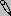
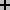
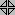
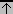
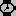

# Interfaces gráficas com Python e Tkinter

Repositório em construção!

Os códigos contidos neste repositório são apenas para referencia (cookbook) e estudo.

Informações importantes sobre os widgets devo adicionar via docstring com o tempo.

Entre em contato caso encontre algum erro ou se preferir abra uma issue :relaxed:.

## Instalação

### Fedora

```bash
sudo dnf install python3-tkinter
```

### Ubuntu

```bash
sudo apt install python3-tk
```

### macOS

O instalador do [site oficial](https://www.python.org/) do Python já instala o Tkinter.

### Windows

O instalador do [site oficial](https://www.python.org/) do Python já instala o Tkinter.

## Tkinter

Tkinter é a biblioteca padrão para construção de interfaces gráficas com Python, a mesma acompanha a [distribuição oficial de Python](https://www.python.org/).http://pyinstaller.readthedocs.io/en/v3.3.1/

Tkinter é baseado no toolkit [Tcl/Tk](http://www.tcl.tk/), da linguagem Tcl.

Para verificar os parâmetros que um determinado widget pode utilizar:

```python
print(tk.Button().keys())
```

Para configurar os widgets o Tkinter fornece pelo menos 4 formas:

```python
        button = tk.Button(
            master=self,
            text='Botão',
        )
        button.pack()
```
```python
        button = tk.Button(master=self)
        button['text'] = 'Botão'
        button.pack()
```
```python
        button = tk.Button(master=self)
        button.config(text='Botão')
        button.pack()
```
```python
        button = tk.Button(master=self)
        button.configure(text='Botão')
        button.pack()
```
> **OBS**: Lembre-se de substituir `self` por uma instância de `tk.Tk()`.

As 4 formas presentadas a cima levam ao mesmo resultado, ficando a cargo de cada equipe definir qual será o padrão para o projeto.

### Command

- [command](src/command/command.py).
- [command utilizando classe](src/command/command_with_class.py).

### Event

- [event](src/events/events.py).
- [event utilizando classe](src/events/events_with_class.py).

### Protocol

- [protocol utilizando classe](src/protocols/protocols_with_class.py).

### Style 

- [style tk](src/style/style_tk.py).
- [style ttk](src/style/style_ttk.py).
- [Cursores](src/style/cursor.py).
- [Tabela com o nome dos cursores](#tipos-de-cursor).

### Widgets

- [Button](src/widgets-tk/button.py).
- [Canvas](src/widgets-tk/canvas_with_scrollbar.py).
- [Checkbutton](src/widgets-tk/checkbutton.py).
- [Entry](src/widgets-tk/entry.py).
- [Frame](src/frames/frames.py).
- [Frame utilizando classe](src/frames/frames_with_class.py).
- [Alternar entre Frames](src/frames/change_frames.py).
- [Label](src/widgets-tk/label.py).
- [LabelFrame](src/widgets-tk/labelframe.py).
- [Listbox](src/widgets-tk/listbox_with_scrollbar.py).
- [Menu](src/widgets-tk/menu.py).
- [Menubutton](src/widgets-tk/menubutton.py) (obsoleto a partir da versão 8.0?).
- [Message](src/widgets-tk/message.py).
- [PanedWindow](src/widgets-tk/panedwindow.py).
- [Radiobutton](src/widgets-tk/radiobutton.py).
- [Scale](src/widgets-tk/scale.py).
- [Scrollbar](src/widgets-tk/scrollbar_x_y_axis.py).
- [Spinbox](src/widgets-tk/spinbox.py).
- [Text](src/widgets-tk/text.py).
- [MessageBox](src/widgets-tk/messagebox.py).
- [Toplevel](src/toplevel/toplevel.py).
- [Toplevel utilizando classe](src/toplevel/toplevel_with_class.py).

### Widgets ttk

- [Button](src/widgets-ttk/button.py).
- [Checkbutton](src/widgets-ttk/checkbutton.py).
- [Combobox](src/widgets-ttk/combobox.py).
- [Entry](src/widgets-ttk/entry.py).
- [Frame](src/widgets-ttk/frame.py).
- [Label](src/widgets-ttk/label.py).
- [LabelFrame](src/widgets-ttk/labelframe.py).
- [Menubutton](src/widgets-ttk/menubutton.py).
- [Notebook](src/widgets-ttk/notebook.py).
- [PanedWindow](src/widgets-ttk/panedwindow.py).
- [Progressbar](src/widgets-ttk/progressbar.py).
- [Progressbar com thread](src/widgets-ttk/progressbar_with_thread.py).
- [Radiobutton](src/widgets-ttk/radiobutton.py).
- [Scale](src/widgets-ttk/scale.py).
- [Scrollbar](src/widgets-ttk/scrollbar_x_y_axis.py).
- [Separator](src/widgets-ttk/separator.py).
- [Sizegrip](src/widgets-ttk/sizegrip.py).
- [Spinbox](src/widgets-ttk/spinbox.py).
- [Treeview](src/widgets-ttk/treeview.py).

### Tipos de cursor

| Cursor                                        | Nome                  | Cursor                                        | Nome              |
| --------------------------------------------- | --------------------- | --------------------------------------------- |------------------ |
| 	    | X_cursor              | 	| lr_angle          |
| 	    | arrow	                | 	| man               |
| 	    | based_arrow_down 	    | 	| middlebutton      |
| 	    | based_arrow_up	    | 	| mouse             |
| 	    | boat	                | 	| pencil            |
| 	    | bogosity	            | 	| pirate            |
| 	    | bottom_left_corner    | 	| plus              |
| 	    | bottom_right_corner   | 	| question_arrow    |
| 	    | bottom_side           | 	| right_ptr         |
|    | bottom_tee            | 	| right_side        |
| 	| box_spiral            | 	| right_tee         |
| 	| center_ptr            | 	| rightbutton       |
| 	| circle                | 	| rtl_logo          |
| 	| clock                 | 	| sailboat          |
| 	| coffee_mug            | 	| sb_down_arrow     |
| 	| cross                 | 	| sb_h_double_arrow |
| 	| cross_reverse         | 	| sb_left_arrow     |
| 	| crosshair             | 	| sb_right_arrow    |
| 	| diamond_cross         | 	| sb_up_arrow       |
| 	| dot                   | 	| sb_v_double_arrow |
| 	| dotbox                | 	| shuttle           |
| 	| double_arrow          | 	| sizing            |
| 	| draft_large           | 	| spider            |
| 	| draft_small           | 	| spraycan          |
| 	| draped_box            | 	| star              |
| 	| exchange              | 	| target            |
| 	| fleur                 | 	| tcross            |
| 	| gobbler               | 	| top_left_arrow    |
| 	| gumby                 | 	| top_left_corner   |
| 	| hand1                 | 	| top_right_corner  |
| 	| hand2                 | 	| top_side          |
| 	| heart                 | 	| top_tee           |
| 	| icon                  | 	| trek              |
| 	| iron_cross            | 	| ul_angle          |
| 	| left_ptr              | 	| umbrella          |
| 	| left_side             | 	| ur_angle          |
| 	| left_tee              | 	| watch             |
| 	| leftbutton            | 	| xterm             |
| 	| ll_angle              |                                               |                   |

#### Windows

cursores nativos do sistema:

- arrow
- center_ptr
- crosshair
- fleur
- ibeam
- icon
- sb_h_double_arrow
- sb_v_double_arrow
- watch
- xterm

Cursores adicionais:

- no
- starting
- size
- size_ne_sw
- size_ns
- size_nw_se
- size_we
- uparrow
- wait

> O cursor `no` pode ser utilizado para remover o cursor.

#### Mac OS X

cursores nativos do sistema:

- arrow
- cross
- crosshair
- ibeam
- plus
- watch
- xterm

Cursores adicionais:

- copyarrow
- aliasarrow
- contextualmenuarrow
- text
- cross-hair
- closedhand
- openhand
- pointinghand
- resizeleft
- resizeright
- resizeleftright
- resizeup
- resizedown
- resizeupdown
- none
- notallowed
- poof
- countinguphand
- countingdownhand
- countingupanddownhand
- spinning

## Exemplos

Lembre-se de verificar e instalar as dependências do arquivo `Pipfile` ([Pipenv](https://github.com/pypa/pipenv)).

- [CRUD com SQLite](src/examples/crud_sqlite) (Não possui dependências).
- [CRUD com SQLite e SQLAchemy](src/examples/crud_sqlachemy).
- [CRUD com SQLite, SQLAchemy e utilizando frames](src/examples/crud_sqlachemy_with_frames).
- [Plotando gráfico](src/examples/plot_graph).
